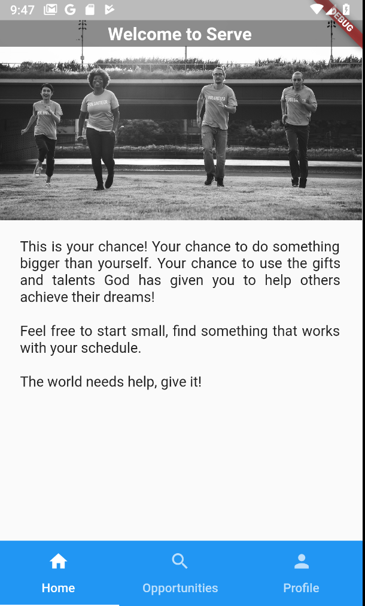

# Serve

Serve others by volunteering for opportunities created by your church and their mission partners!

## Basics
We are using [Firebase](https://firebase.google.com/) because there isn't a great integration with [AWS Appync](https://aws.amazon.com/appsync/) / [Amplify](https://aws.amazon.com/amplify/) and it gives  great flexability to quickly create applications. 

## Getting Started with Flutter

A few resources to get you started if this is your first Flutter project:

- [Lab: Write your first Flutter app](https://flutter.io/docs/get-started/codelab)
- [Catalog: Really helpful examples](https://itsallwidgets.com/flutter-app/flutter-catalog-with-source-code-side-by-side)
- [Cookbook: Useful Flutter samples](https://flutter.io/docs/cookbook)
- [Online documentation](https://flutter.io/docs), which offers tutorials, 
samples, guidance on mobile development, and a full API reference.

